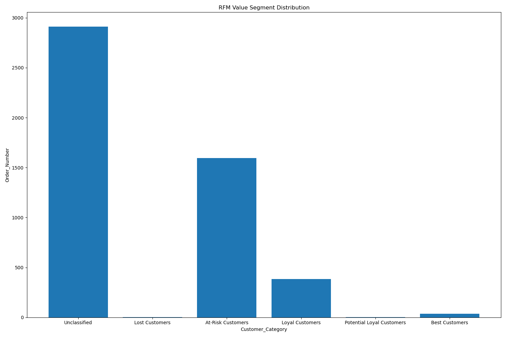

# RFM Analyzer Tool

 ## 🧑‍💻Project Overview
 
The RFM Analyzer Tool is a simplified solution for businesses to perform customer segmentation using RFM (Recency, Frequency, Monetary) analysis. This tool consolidates what was previously a three-step process into a single, unified module called RFM_Module.py. Users can simply upload their Excel data and receive comprehensive RFM analysis results with minimal technical expertise.

##  💡 Project Purpose
This aims to democratize access to RFM analysis by eliminating technical barriers. Instead of requiring users to understand and execute three separate processes (data loading, scoring, and result generation), everything is now handled by a single function call.This project performs **RFM (Recency, Frequency, Monetary)** analysis on customer transaction data using Python and `pandas`. The goal is to segment customers into meaningful categories such as "Best Customers", "Loyal Customers", and "Lost Customers" based on their purchase behavior.

## 📊 What is RFM Analysis?

RFM stands for:
- **Recency (R):** How recently a customer made a purchase.
- **Frequency (F):** How often a customer makes a purchase.
- **Monetary (M):** How much money a customer spends.

RFM analysis helps businesses understand customer value and behavior, enabling effective targeting and personalization.

## 🧰 Features

- Calculates Recency, Frequency, and Monetary scores using quantiles
- Combines RFM scores into a single `RFM_Score`
- Classifies customers into segments:
  - Best Customers
  - Loyal Customers
  - Potential Loyal Customers
  - At-Risk Customers
  - Lost Customers
  - Unclassified
- Uses `PERCENTILE.EXC`-like behavior (exclusive percentiles)


## 📁 Input Data

The input data (`df`) must contain the following columns:

| Column Name    | Description                        |
|----------------|------------------------------------|
| `Date`         | Last transaction date (datetime)   |
| `Order_Number` | Number of purchases per customer   |
| `Amount`       | Total amount spent by the customer |

> This DataFrame is expected to be imported from `Load_Data.py`.

```python
import pandas as pd
import numpy as np
import datetime
df = pd.read_excel("CUSID_Amts.xlsx") # loading the dataset
df["Date"] = pd.to_datetime(df["Date"])
df = df.groupby("Customer_ID").agg({"Amount":"sum", "Date": "max", "Customer_ID" : "count"}).rename(columns={"Customer_ID":"Order_Number"}).reset_index()  # Data processin
  
print(df.head())

```


### RFM Module (RFM Module.py)
The purpose of this project is to make RFM analysis more efficient for users. The main goal was to create an RFM Analyzer Tool that allows anyone to simply upload their Excel file and automatically receive the corresponding code and RFM analysis. To achieve this, I combined the entire three-step process into one file, which I named `RFM_Module.py`. In this module, I utilized functions to integrate the functionalities of the three separate files: `Load_Data.py`, `Data_Scorer.py`, and `result.py`.


``` python
import pandas as pd
import numpy as np
import datetime
import matplotlib.pyplot as plt
import seaborn as sns


def simple_rfm_analysis(filepath="CUSID_Amts.xlsx"):
    """
        filepath (str): Path to Excel file containing transaction data
    """
    # Load and preprocess data
    df = pd.read_excel(filepath)
    df["Date"] = pd.to_datetime(df["Date"])
    
    # Aggregate by customer
    df = df.groupby("Customer_ID").agg({
        "Amount": "sum",
        "Date": "max",
        "Customer_ID": "count"
    }).rename(columns={"Customer_ID": "Order_Number"}).reset_index()

    # Calculate RFM metrics
    df["R"] = (pd.Timestamp.now() - df["Date"]).dt.days  # Recency
    df["F"] = df["Order_Number"]  # Frequency
    df["M"] = df["Amount"]  # Monetary

    # Scoring function (reused for R/F/M)
    def calculate_score(series, ascending=False):
        percentiles = series.quantile([0.2, 0.4, 0.6, 0.8], interpolation='higher')
        def get_score(x):
            if x > percentiles[0.8]: return 5
            elif x > percentiles[0.6]: return 4
            elif x > percentiles[0.4]: return 3
            elif x > percentiles[0.2]: return 2
            else: return 1
        return series.apply(get_score)

    # Apply scoring
    df['Recency'] = calculate_score(df["R"], ascending=True)
    df['Frequency'] = calculate_score(df["F"])
    df['Monetary'] = calculate_score(df["M"])

    # Combine scores and categorize
    df['RFM_Score'] = df['Recency'].astype(str) + df['Frequency'].astype(str) + df['Monetary'].astype(str)
    
    def categorize_customers(row):
        if row['Recency'] == 5 and row['Frequency'] >= 4 and row['Monetary'] >= 4:
            return "Best Customers"
        elif 3 <= row['Recency'] <= 4 and row['Frequency'] >= 4 and row['Monetary'] >= 3:
            return "Loyal Customers"
        elif 3 <= row['Recency'] <= 4 and row['Frequency'] >= 2 and row['Monetary'] >= 2:
            return "Potential Loyal Customers"
        elif 2 <= row['Recency'] <= 3 and row['Frequency'] >= 3 and row['Monetary'] >= 3:
            return "At-Risk Customers"
        elif row['Recency'] == 1 and row['Frequency'] <= 2 and row['Monetary'] <= 2:
            return "Lost Customers"
        return "Unclassified"
    
    df['Customer_Category'] = df.apply(categorize_customers, axis=1)

    # Generate visualizations
    plt.figure(figsize=(15, 10))
    plt.bar(df["Customer_Category"], df["Order_Number"]) 
    plt.title('RFM Value Segment Distribution')
    plt.xlabel("Customer Category")
    plt.ylabel("Order Count")
    plt.tight_layout()
    plt.savefig("RFM_Value.png")
    plt.close()
    
    plt.figure()
    sns.boxplot(data=df[['Recency', 'Frequency', 'Monetary']])
    plt.title('Distribution of RFM Scores')
    plt.ylabel('Score')
    plt.savefig("Distribution.png")
    plt.close()

    return df

# Example usage:
# results = simple_rfm_analysis("your_data.xlsx")
# print(results.head())

```

### Bar Graph 


### Box Plot


### Final Step (Main.py)

This script performs an RFM (Recency, Frequency, Monetary) analysis on a file provided via the command line. It starts by importing the `sys` module to handle command-line arguments and the `simple_rfm_analysis` function from the `RFM_Module` to perform the analysis. The script checks if a file path is passed as an argument; if not, it exits. If the file path is provided, it calls the `simple_rfm_analysis()` function with the file path as input, processes the data, and stores the RFM analysis results in a variable. Finally, the script prints the first few rows of the analysis results using `head()`. To run the script, the user would provide the file path in the command line, like `python script_name.py path_to_excel_file.xlsx`, Example:  `python Main.Py CUSID_Amts.xlsx`  and the results will be displayed in the terminal. Furthermore the code snippet saves the results of an RFM analysis to an Excel file named rfm_output.xlsx. It begins by defining the file name and then prints the full file path using os.path.abspath(), which helps confirm where the file will be stored on the system. Finally, it uses the to_excel() function from the pandas library to export the DataFrame result_df to the specified Excel file. The parameter index=False ensures that the row indices are not included in the Excel output, resulting in a cleaner and more readable file. This step is useful for sharing, storing, or further analyzing the output from the RFM analysis.


``` Python
import sys
import os
from RFM_Module import simple_rfm_analysis

# Check if file path is provided via command line
if len(sys.argv) < 2:
    print("Usage: python your_script.py <input_file>")
    sys.exit()

# Get the file path
file_path = sys.argv[1]

# Run the RFM analysis
result_df = simple_rfm_analysis(file_path)

# Save the result to an Excel file
output_path = "rfm_output.xlsx"
print("Saving output to:", os.path.abspath(output_path))
result_df.to_excel(output_path, index=False)

# Print first few rows
print(result_df.head())

```


### 🚀  Benefits of This Approach

1. Simplicity: Users only need to call a single function
2. Flexibility: Customizable column names for different data formats
3. Efficiency: Streamlined process reduces code redundancy
4. Accessibility: Non-technical users can perform advanced customer segmentation
5. Maintainability: Centralized code is easier to update and enhance


## Conclusion

The RFM Analyzer Tool represents a significant advancement in making data-driven customer segmentation accessible to businesses of all sizes. By consolidating what was previously a complex, multi-step process into a single, user-friendly function, this tool eliminates technical barriers and empowers marketing teams to make informed decisions based on customer behavior patterns.
RFM analysis is a powerful technique that helps businesses identify their most valuable customers, recognize those at risk of churning, and spot opportunities for growth. However, its implementation has traditionally required technical expertise that many small and medium businesses lack. This tool bridges that gap, democratizing access to sophisticated customer analytics.With minimal setup and just a few lines of code, users can transform raw customer transaction data into actionable insights. This enables businesses to:

Target their best customers with retention programs
Re-engage at-risk customers before they're lost
Develop strategies to convert occasional buyers into loyal customers
Allocate marketing resources more effectively

The modular design ensures that the tool can evolve with changing business needs, while the straightforward implementation makes it accessible even to those with limited programming experience. By putting powerful customer segmentation capabilities into the hands of more businesses, the RFM Analyzer Tool helps drive more effective, customer-centric marketing strategies across organizations of all sizes.


